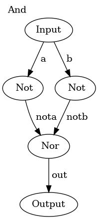

## nand2tetris-hdl-visualizer

Utility to visualize HDL files from Nand2Tetris

### Examples

```
CHIP And {
    IN a, b;
    OUT out;

    PARTS:
	Not(in=a, out=nota);
	Not(in=b, out=notb);
	Nor(a=nota, b=notb, out=out);
}
```
is rendered as

